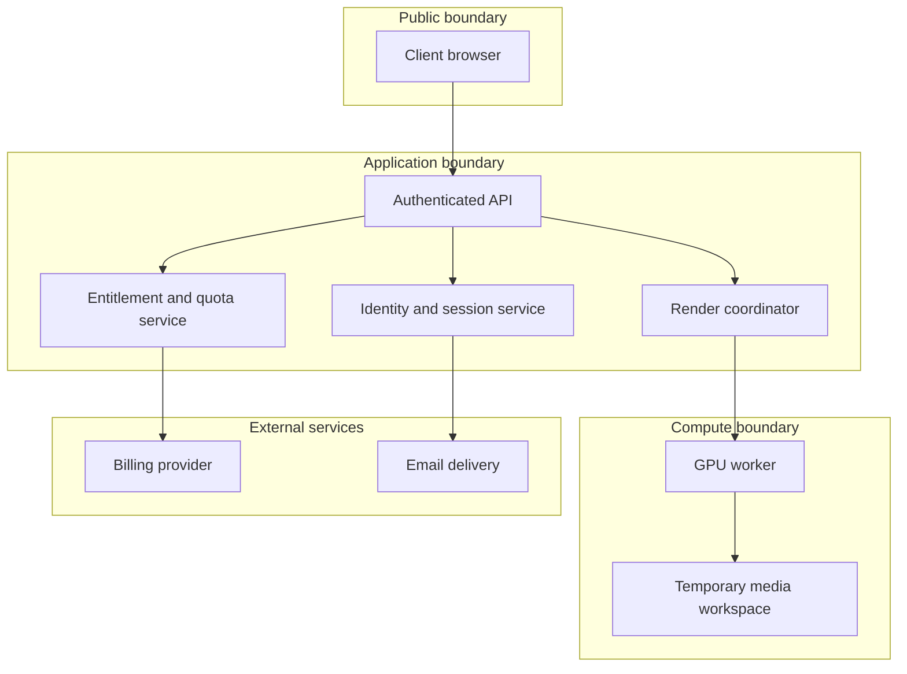

# Architecture Notes

This document describes AiTube at a portfolio-safe level. It intentionally omits private endpoints, credentials, deployment topology, model configuration details, and production source code.

## Product layers

| Layer | Responsibility |
|---|---|
| Public web | Landing page, pricing, product explanation, legal and contact routes |
| Identity | Email verification, sessions, account state |
| Entitlements | Free/Premium/Pro quotas, duration limits, watermark policy |
| Billing | Subscription checkout and billing-event processing |
| Creator UI | Avatar selection/upload, text/audio input, voice selection, export options |
| Job coordination | Validation, queueing, progress, cancellation, failure handling |
| Media pipeline | Speech/audio preparation, idle motion, lip sync, background/export processing |
| Compute | Local NVIDIA GPU or remote GPU worker dispatch |
| Persistence | Account state, usage records, job metadata, controlled output retention |

## Trust boundaries

## Job lifecycle

1. **Request validation** — check authentication, rights confirmations, file type, duration, and plan limits.
2. **Entitlement decision** — reserve or consume quota using a server-side operation.
3. **Preparation** — normalize media and produce or validate audio.
4. **Motion** — optionally generate subtle portrait movement.
5. **Lip synchronization** — animate the selected or uploaded character against the audio.
6. **Export** — encode the requested deliverable and apply watermark/background policy.
7. **Completion** — expose the authorized download and record the final job state.
8. **Cleanup** — expire temporary working data according to retention policy.

## Failure and cancellation principles

- A browser refresh must not create uncontrolled duplicate GPU work.
- Cancellation should terminate the active stage and leave a clear terminal job state.
- Quota refunds depend on whether costly compute has started; the decision belongs on the server.
- User-visible errors should not expose filesystem paths, commands, tokens, or internal host data.
- Logs should identify a job without storing more user content than operationally necessary.

## Scaling direction

The architecture supports separating the web application from GPU workers. A production queue can dispatch jobs to remote compute while the web layer remains responsive. Worker concurrency, retries, idempotency, storage lifecycle, and rate limits should be managed explicitly as usage grows.
