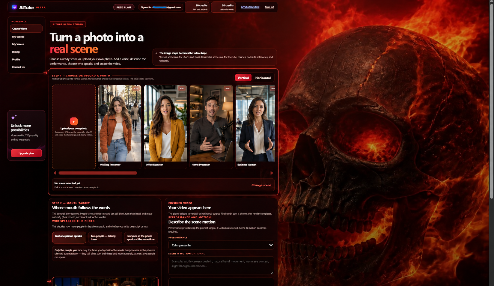
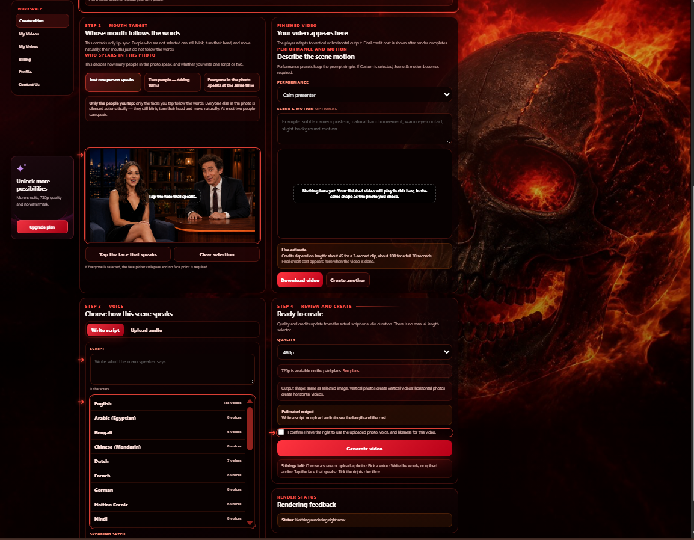
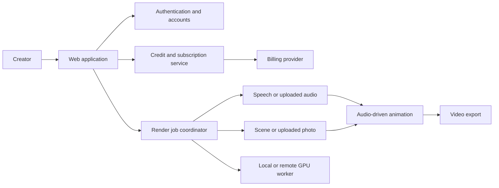

# AiTube Ultra — Production AI Scene Video Platform

AiTube Ultra is a production web platform for turning a single photo into a short cinematic scene. A creator can upload a photo or choose a ready scene, add authorized audio or write a script, and generate a browser-based video where the selected person speaks and moves inside a living scene.

This repository is a public engineering case study. It documents the product, architecture, technical decisions, safety boundaries, and deployment approach without publishing production source code, model weights, customer data, credentials, private infrastructure, or proprietary pipeline details.

## Live product

Visit **[aitubeapp.com](https://aitubeapp.com)**. A free trial is available with email verification and no credit card required.

## Creator interface

<table>
  <tr>
    <td width="50%">
      
    </td>
    <td width="50%">
      
    </td>
  </tr>
</table>

The production creator interface combines the Ultra workflow in one browser screen: choose a ready scene or upload an authorized photo, decide whose mouth follows the words, add audio or write a script, review the credit estimate, and submit the render job.

## What the product demonstrates

- A complete AI media workflow rather than a standalone model demo
- Passwordless authentication and account-based credit limits
- Subscription billing and plan enforcement
- Local and remote GPU execution paths
- Queued rendering with progress tracking and cancellation
- Text-to-speech and user-supplied audio workflows
- Audio-driven mouth movement that is not tied to the written language when audio is supplied
- Ready scenes plus authorized custom photo uploads
- Vertical and horizontal creator-video workflows
- A browser-based product interface backed by production services

## Core user capabilities

| Capability | User value |
|---|---|
| Ready scenes | Start from a prepared cinematic layout without designing a scene first |
| Custom photo upload | Build a video from an owned or authorized image |
| Script or audio input | Generate speech from text or use an authorized recording |
| Mouth target control | Decide whether everyone speaks or only selected people follow the words |
| Scene-style output | Create short videos with more than a static talking head |
| Vertical and horizontal formats | Produce videos for Shorts/Reels or wider web content |
| Credit-based plans | Match usage to monthly production needs |
| Downloadable output | Use generated media in editors, ads, demos, explainers or social posts |

## Language support

AiTube Ultra separates speech generation from audio-driven animation:

- Built-in text-to-speech is available in the languages and voices exposed by the current catalog.
- Uploaded audio can drive the animation regardless of language, provided the recording is valid and the uploader has the necessary rights.

This distinction matters: the platform does not claim that every language can be synthesized, but its audio-driven animation workflow is not restricted to the built-in voice catalog.

## High-level architecture

The production application uses a web-facing API layer for authentication, billing, and routing. Rendering is handled as a staged job so that progress, cancellation, credit decisions, and failures can be managed without coupling them to the browser session.

## Rendering workflow

1. Validate the account, credits, and input constraints.
2. Accept a ready scene or an authorized user image.
3. Generate speech from text or validate uploaded audio.
4. Resolve the selected mouth target.
5. Run the audio-driven scene animation job.
6. Produce the downloadable video output.
7. Return the result and update usage state.

Production can dispatch rendering to remote GPU capacity, allowing the web and account layers to remain separate from compute-heavy inference.

## Engineering decisions

### Multiple isolated runtimes

Some media and ML components require incompatible dependency versions. They are isolated instead of forcing a fragile single environment. The application coordinates them through explicit service boundaries.

### Queue-aware rendering

GPU work is serialized or dispatched through a job layer. Active jobs expose progress and can be cancelled. This avoids launching uncontrolled parallel inference processes when users refresh or submit repeatedly.

### Audio-driven workflow

The animation path consumes audio rather than relying only on the text language. This allows authorized recordings from a broad range of languages to drive a scene even when a matching built-in text-to-speech voice is unavailable.

### Browser-first product flow

The product work is not only the render itself. Account state, credit checks, upload validation, plan routing, progress reporting, errors, and downloadable results are all part of the browser experience.

### Separation of product and model layers

Open-source models provide specialized inference capabilities. AiTube Ultra's product work lies in integrating those capabilities with accounts, credits, billing, validation, queues, progress, cancellation, media conversion, user experience, deployment, and responsible-use controls.

## Responsible use

AiTube Ultra is designed for owned, fictional, synthetic, or otherwise authorized characters and voices. The product does not market itself as a tool for impersonating public figures or other real people.

Product safeguards include or are designed around:

- Explicit confirmation that users have the right to use uploaded images and audio
- Terms, privacy, refund, contact, and abuse-reporting routes
- AI-generated media disclosure in the public experience
- Account suspension and takedown handling for reported misuse
- Avoiding celebrity-impersonation language in product marketing
- Keeping user assets and render outputs out of this public repository

Users remain responsible for the media, scripts, images, and audio they upload and for complying with applicable law and platform rules.

## Open-source foundation

AiTube Ultra integrates open-source components; it is not presented as inventing the underlying research models. Attribution and license compliance are part of the product engineering work.

Each upstream project and model weight remains governed by its own license and usage terms. See [OPEN_SOURCE_NOTICES.md](OPEN_SOURCE_NOTICES.md) for the public attribution policy. A release-specific dependency and weight audit should always be completed before distributing software or changing the production model set.

## Security and privacy boundaries

The public repository intentionally excludes:

- API keys, tokens, webhook secrets, and environment files
- Production databases and user records
- Uploaded images, voices, scripts, and generated videos
- Server addresses, deployment credentials, and private network details
- Model weights and third-party sample media
- Production logs, render caches, and analytics exports
- Proprietary orchestration and abuse-detection rules

The accompanying [SECURITY.md](SECURITY.md) explains how to report a vulnerability. The included validation script fails when common secret-bearing filenames or patterns are added to this case-study repository.

## Repository scope

This is a **portfolio case study**, not the production source distribution. It contains:

- Product and architecture documentation
- A public-safe system diagram
- Responsible-use and security documentation
- Open-source attribution guidance
- A small automated repository-safety check
- Media placeholders for approved screenshots and demonstrations

It does not provide a runnable clone of AiTube Ultra or access to its production infrastructure.

Original case-study materials are published under an all-rights-reserved notice. Referenced third-party technologies remain subject to their respective licenses.

## Suggested demonstrations

- Turn a single authorized photo into a short cinematic scene
- Use a ready scene for vertical social content
- Add authorized audio or write a short script
- Select whose mouth follows the words in a multi-person image
- Download the finished video for use in ads, demos, explainers or social posts

## Status

AiTube Ultra is an independently deployed product available at [aitubeapp.com](https://aitubeapp.com). This case study will evolve as the product, safety controls, and public demonstrations are improved.

## Contact

For Python automation, API integration, AI workflow, or media-pipeline work, use the contact options on the live product or the freelance profiles linked from the [Aradhel GitHub profile](https://github.com/Aradhel).

---

AiTube is a product name used for this project. Third-party names and trademarks belong to their respective owners.
