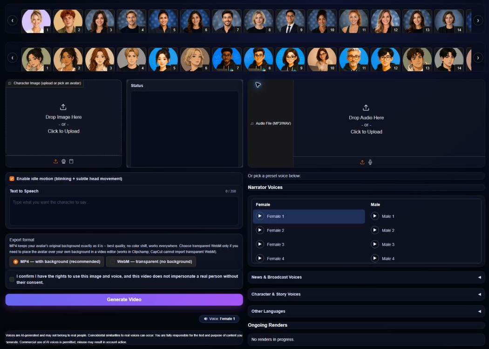
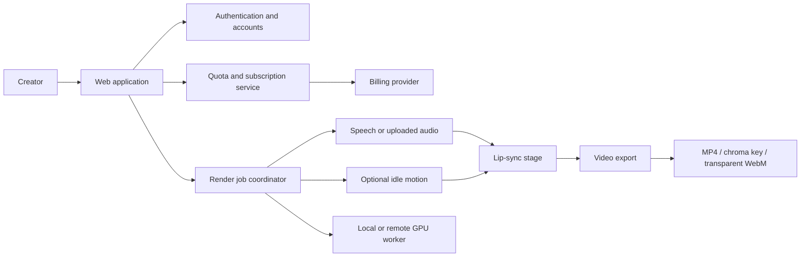

# AiTube — Production AI Avatar Video Platform

AiTube is a production web platform for creating talking-avatar videos from a ready-made or user-supplied character image. A creator can type a script, select a synthetic voice, or upload authorized audio; AiTube then produces a lip-synchronized video that can be downloaded for use in education, presentations, stories, advertisements, and short-form content.

This repository is a public engineering case study. It documents the product, architecture, technical decisions, safety boundaries, and deployment approach without publishing production source code, model weights, customer data, credentials, private infrastructure, or proprietary pipeline details.

## Live product

Visit **[aitubeapp.com](https://aitubeapp.com)**. A free account can be created using email verification; no credit card is required for the free plan.

## Creator interface

The production creator interface combines the complete workflow in one screen: select or upload an authorized avatar, enter text or upload audio, choose a voice and export format, confirm usage rights, and submit the render job.

## What the product demonstrates

- A complete AI media workflow rather than a standalone model demo
- Passwordless authentication and account-based usage quotas
- Subscription billing and plan enforcement
- Local and remote GPU execution paths
- Queued rendering with progress tracking and cancellation
- Text-to-speech and user-supplied audio workflows
- Lip synchronization that remains language-agnostic when audio is supplied
- Ready-made avatars plus authorized custom image uploads
- Standard video, chroma-key, and transparent-background export workflows
- A browser-based product interface backed by production services

## Core user capabilities

| Capability | User value |
|---|---|
| Ready-made avatars | Start creating without producing character artwork first |
| Custom character image | Build videos around an owned or authorized character |
| 40+ synthetic voices | Generate speech directly from a written script |
| Audio upload | Lip-sync speech in languages not covered by the built-in voice catalog |
| Idle motion | Add subtle head and eye movement before lip synchronization |
| Background options | Export a normal composition, chroma-key video, or transparent WebM |
| Account plans | Free, Premium, and Pro quotas support different production needs |
| Downloadable output | Use generated media in editors, presentations, ads, Shorts, or lessons |

## Language support

AiTube separates speech generation from lip synchronization:

- Built-in text-to-speech is available in the languages and voices exposed by the current catalog.
- Uploaded audio can be lip-synchronized regardless of language, provided the recording is valid and the uploader has the necessary rights.

This distinction matters: the platform does not claim that every language can be synthesized, but its audio-driven animation workflow is not restricted to the built-in voice catalog.

## High-level architecture

The production application uses a web-facing API layer for authentication, billing, and routing. Rendering is handled as a staged job so that progress, cancellation, quota decisions, and failures can be managed without coupling them to the browser session.

## Rendering workflow

1. Validate the account, quota, and input constraints.
2. Accept a platform avatar or an authorized user image.
3. Generate speech from text or validate uploaded audio.
4. Optionally create subtle idle movement.
5. Run audio-driven lip synchronization.
6. Produce the selected output format.
7. Return a downloadable result and update usage state.

The local creator build can use an NVIDIA RTX 3060 with 12 GB VRAM. Production can dispatch rendering to remote GPU capacity, allowing the web and account layers to remain separate from compute-heavy inference.

## Engineering decisions

### Multiple isolated runtimes

Some media and ML components require incompatible dependency versions. They are isolated instead of forcing a fragile single environment. The application coordinates them through explicit service boundaries.

### Queue-aware rendering

GPU work is serialized or dispatched through a job layer. Active jobs expose progress and can be cancelled. This avoids launching uncontrolled parallel inference processes when users refresh or submit repeatedly.

### Language-agnostic audio path

Lip synchronization consumes audio rather than relying on the text language. This allows authorized recordings from a broad range of languages to animate a character even when a matching built-in TTS voice is unavailable.

### Editor-friendly exports

Transparent WebM and chroma-key exports allow creators to place a speaking character over another scene. Background separation and export behavior were treated as a product workflow, not merely a model output.

### Separation of product and model layers

Open-source models provide specialized inference capabilities. AiTube's product work lies in integrating those capabilities with accounts, quotas, billing, validation, queues, progress, cancellation, media conversion, user experience, deployment, and responsible-use controls.

## Responsible use

AiTube is designed for owned, fictional, synthetic, or otherwise authorized characters and voices. The product does not market itself as a tool for impersonating public figures or other real people.

Product safeguards include or are designed around:

- Explicit confirmation that users have the right to use uploaded images and audio
- Terms, privacy, refund, contact, and abuse-reporting routes
- AI-generated media disclosure in the public experience
- Account suspension and takedown handling for reported misuse
- Avoiding celebrity-impersonation language in product marketing
- Keeping user assets and render outputs out of this public repository

Users remain responsible for the media, scripts, images, and audio they upload and for complying with applicable law and platform rules.

## Open-source foundation

AiTube integrates open-source components; it is not presented as inventing the underlying research models. Attribution and license compliance are part of the product engineering work.

Key technologies evaluated or used in the pipeline include:

- [MuseTalk](https://github.com/TMElyralab/MuseTalk) for real-time audio-driven lip synchronization
- [SadTalker](https://github.com/OpenTalker/SadTalker) for optional portrait motion
- [Kokoro](https://github.com/hexgrad/kokoro) and/or [Chatterbox](https://github.com/resemble-ai/chatterbox) for speech workflows, depending on the deployed catalog
- [rembg](https://github.com/danielgatis/rembg) for still-image background separation
- [Gradio](https://github.com/gradio-app/gradio) for the interactive creator interface
- [FastAPI](https://github.com/fastapi/fastapi) for production web/API integration
- [FFmpeg](https://ffmpeg.org/) for media inspection, encoding, and export

Each upstream project and model weight remains governed by its own license and usage terms. See [OPEN_SOURCE_NOTICES.md](OPEN_SOURCE_NOTICES.md) for the public attribution policy. A release-specific dependency and weight audit should always be completed before distributing software or changing the production model set.

## Security and privacy boundaries

The public repository intentionally excludes:

- API keys, tokens, webhook secrets, and environment files
- Production databases and user records
- Uploaded images, voices, scripts, and generated videos
- Server addresses, deployment credentials, and private network details
- Model weights and third-party sample media
- Production logs, render caches, and analytics exports
- Proprietary orchestration and abuse-detection rules

The accompanying [SECURITY.md](SECURITY.md) explains how to report a vulnerability. The included validation script fails when common secret-bearing filenames or patterns are added to this case-study repository.

## Repository scope

This is a **portfolio case study**, not the production source distribution. It contains:

- Product and architecture documentation
- A public-safe system diagram
- Responsible-use and security documentation
- Open-source attribution guidance
- A small automated repository-safety check
- Media placeholders for approved screenshots and demonstrations

It does not provide a runnable clone of AiTube or access to its production infrastructure.

Original case-study materials are published under an all-rights-reserved notice. Referenced third-party technologies remain subject to their respective licenses.

## Suggested demonstrations

- Generate speech from a script using a ready-made avatar
- Animate a custom, authorized character image
- Upload a recording in a language outside the built-in TTS catalog
- Export a transparent WebM and place it over a video-editor timeline
- Create a two-character scene by generating each authorized character separately and composing the results in an editor

## Status

AiTube is an independently deployed product available at [aitubeapp.com](https://aitubeapp.com). This case study will evolve as the product, safety controls, and public demonstrations are improved.

## Contact

For Python automation, API integration, AI workflow, or media-pipeline work, use the contact options on the live product or the freelance profiles linked from the [Aradhel GitHub profile](https://github.com/Aradhel).

---

AiTube is a product name used for this project. Third-party names and trademarks belong to their respective owners.
